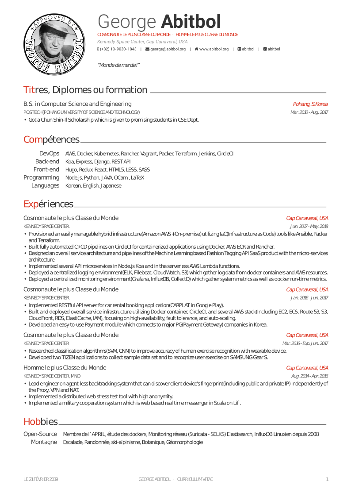
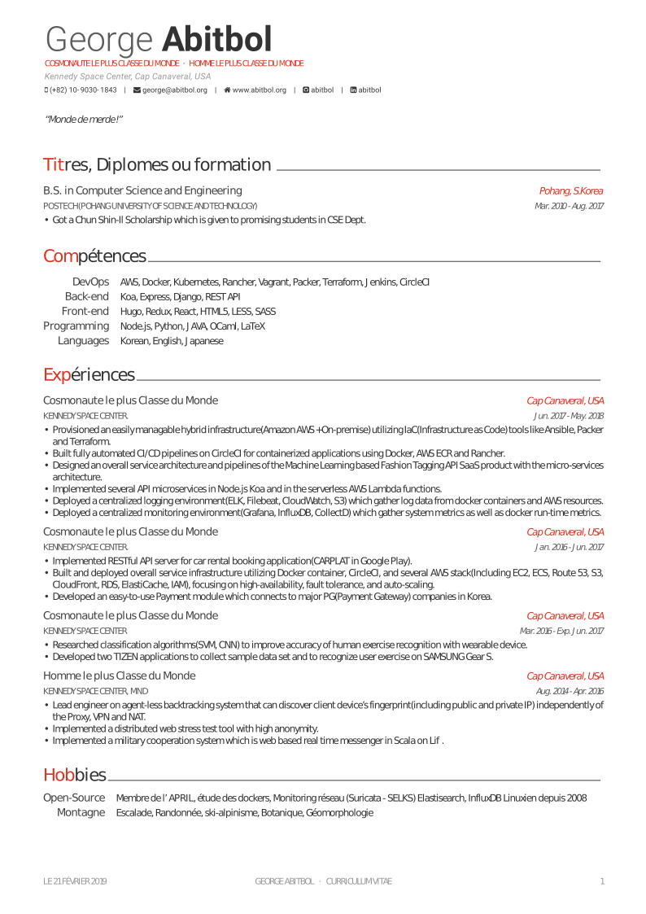
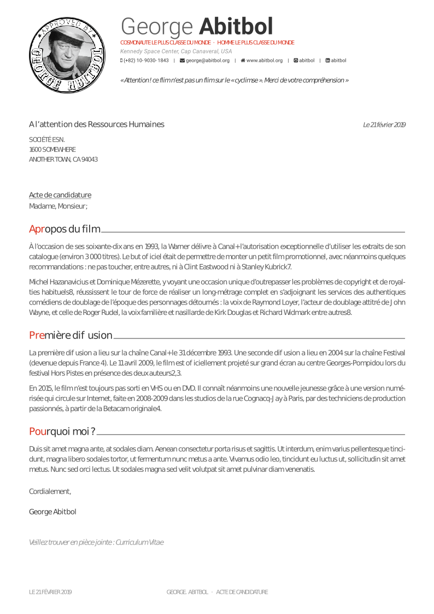
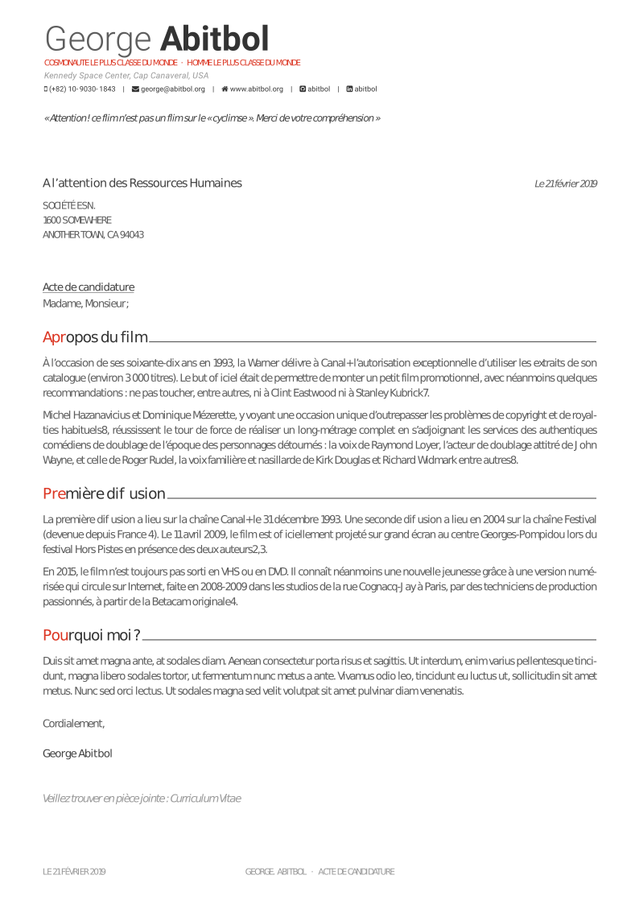
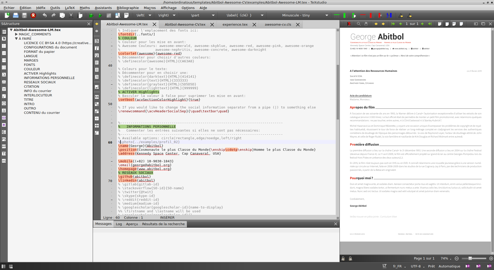
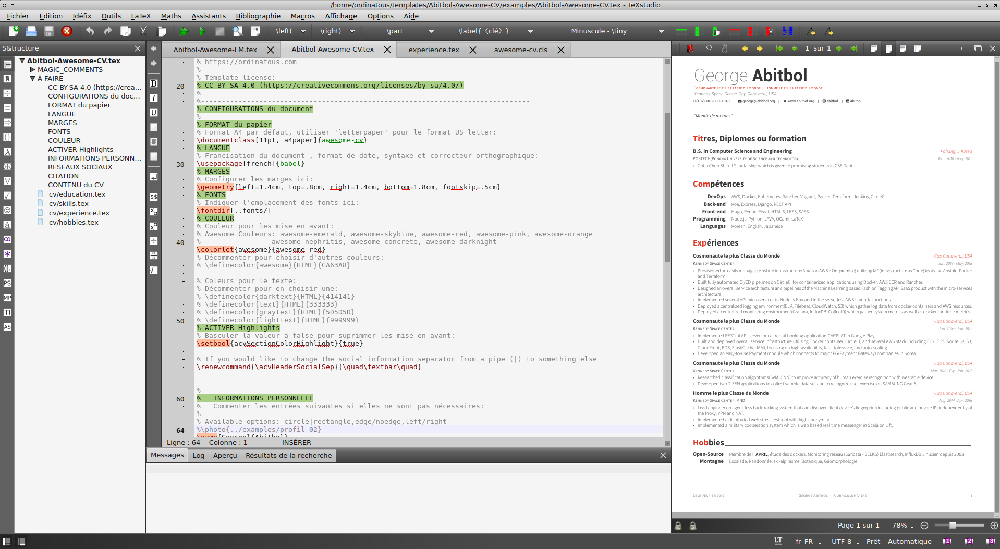

# Abitbol-Awesome-CV

---
<h1 align="center">
  <a href="https://github.com/ordinatous/Awesome-CV" title="Abitbol-Awesome-CV Documentation">
    
  </a>
  <br />
  Le CV le plus classe du Monde
</h1>


<div align="center">
  <!---->
  
  <a href="examples/Abitbol-Awesome-CV.pdf">
    
  </a>
  <a href="examples/Abitbol-Awesome-LM.pdf">
    
  </a>
</div>

---

<br />

## Qu'est que Abitbol-Awesome-CV ?

**Abitbol Awesome CV** est un model LaTex pour éditer un **CV(Curriculum Vitae)** et une  **Lettre de motivation**.

Projet original de : [Posquit0](https://posquit0.com/), dépot [github](https://github.com/posquit0/Awesome-CV) , inspiré de  [Fancy CV](https://www.sharelatex.com/templates/cv-or-resume/fancy-cv).

Il est plutot facile a modifier et a se réapproprier. J'ai francisé le projet et ai ajouté des repères dans le document afin de mieux naviguer dans la structure et apporter les modifications souhaitées.


## Prévisualiser les documents

#### Curicullum Vitae

Visible ici: [PDF](https://github.com/ordinatous/Abitbol-Awesome-CV/blob/master/examples/Abitbol-Awesome-CV.pdf)

| Avec photo | Sans photo |
|:---:|:---:|
| [](examples/Abitbol-Awesome-LM.pdf)  | [](https://raw.githubusercontent.com/ordinatous/Awesome-CV/blob/master/examples/Abitbol-Awesome-CV-01.pdf) |

#### Lettre de Motivation

Visible ici: [PDF](https://raw.githubusercontent.com/ordinatous/Awesome-CV/blob/master/examples/Abitbol-Awesome-LM.pdf)

| Avec photo | Sans photo |
|:---:|:---:|
| [](examples/Abitbol-Awesome-LM.pdf)  | [](examples/Abitbol-Awesome-LM.pdf) |


## Comment s'en servir

#### Pré-requis

Vous devez disposer de la distribution TexLive.

[TexLive](https://tug.org/texlive/) est disponnible pour Linux, MacOS et Microsoft.

  [Plusieurs outils existent pour les différents système d'exploitations (Windows, Mac, \*nix)](http://tex.stackexchange.com/q/55437) mais TeX Live est recommandé.
Vous pouvez installer  [install TeX from upstream](http://tex.stackexchange.com/q/1092) (recommended; most up-to-date) or use `sudo apt-get install texlive-full`, ou compiler depuis les sources.

#### Usage

Dans un terminal exécuter cette commande:

```bash
$ xelatex {votre-cv}.tex
```

Vous obtiendrez: ``{votre-cv}.pdf``

#### Modifications

* [**Rapide en ligne avec Overleaf**](https://www.overleaf.com/)
* [**Avec TexStudio**](https://www.texstudio.org/)

Les documents **maitres** sont dans le répertoire *examples*:
* [Abitbol-Awesome-CV.tex](examples/Abitbol-Awesome-CV.tex)
* [Abitbol-Awesome-LM.tex](examples/Abitbol-Awesome-LM.tex)

Les sections Educations/Formations, compétences, Expériences et hobbies sont contenu dans */examples/cv*.

#### Commentaires et structure

Avec *Texstudio* vous disposez d'une arborescence indiquant les repères de la structure du document, ainsi on trouve rapidement ce que l'on souhaite modifier.

##### Lettre de motivations
Chaque élément du document est commenté, et un repère est ajouté dans la structure.


##### CV
L'arborescence permet d'accéder directement aux différentes sections du CV.



## Credit

[**LaTeX**](http://www.latex-project.org) est un langage de programmation permettant d'éditer un document sans se soucier (ou si peu) de la mise en page, très utilisé dans le milieu universitaire, et scientifique.

[**LaTeX FontAwesome**](https://github.com/furl/latex-fontawesome) FontAwesome permet d'obtenir les pictogram des réseaux sociaux fonctionnant avec XeLaTeX.

[**Roboto**](https://github.com/google/roboto) est la font par défaut de Android et GoogleOS ,Google’s visual language, Material Design.

[**Source Sans Pro**](https://github.com/adobe-fonts/source-sans-pro) is a set of OpenType fonts that have been designed to work well in user interface (UI) environments.


## Contact

Les fichiers `.tex` sont totalement adaptable à votre goût pour obtenir des courrier et cv personnalisé .


Enjoy!
